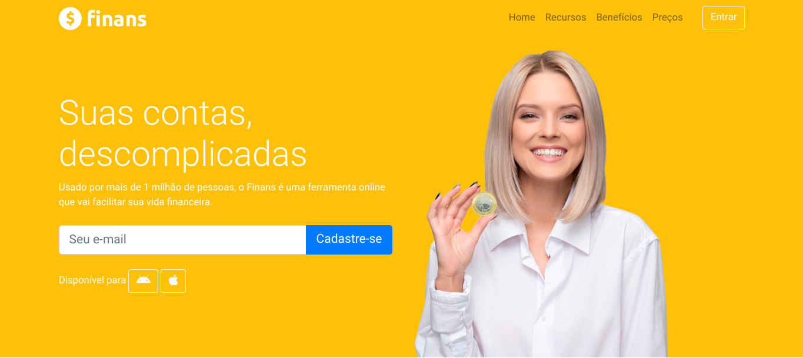

# Finans

## 🚀 Tecnologias Utilizadas

Esse projeto foi desenvolvido com as seguintes tecnologias:

- HTML e CSS
- Bootstrap 4

## 💻 Projeto

O Finans é uma plataforma online projetada para simplificar sua gestão financeira e trazer facilidade para o seu dia a dia..

- [Acesse o projeto finalizado](https://rmeiio.github.io/Finans/)

## Autor

Roger Correa - [@rcorreamello](https://github.com/rmeIIo/)
(projeto realizado para fins educativos)

## Licença

Este projeto está licenciado sob a [MIT License](LICENSE).
